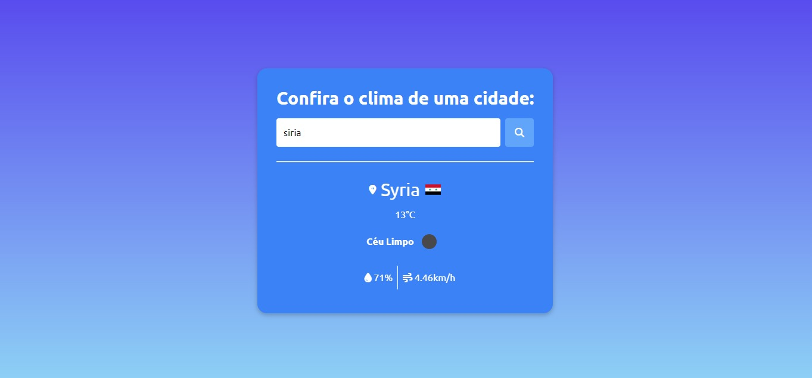

<h1 align="center">Cities weather with API</h1>

Programa exclusivo e  gratuito, promovido pela Rocketseat para ensino de tecnologias WEB.

  <a href="#-tecnologias">Tecnologias</a>&nbsp;&nbsp;&nbsp;|&nbsp;&nbsp;&nbsp;
  <a href="#-projeto">Projeto</a>&nbsp;&nbsp;&nbsp;|&nbsp;&nbsp;&nbsp;
  <a href="#memo-licença">Licença</a>

  

 

  

## 🚀 Tecnologias

Esse projeto foi desenvolvido com as seguintes tecnologias:

- HTML e CSS
- Git e Github
- Tailwind CSS
- JavaScript
- API

## 💻 Projeto

Projeto feito para consulta de clima de cidades com API da [OpenWeather](https://openweathermap.org/current#data), primeiro projeto feito com API.

Veja como instalar o Tailwind CSS passo a passo em sua máquina. [Documentção do Tailwind CSS ](https://tailwindcss.com/docs/installation)

## :memo: Licença

Esse projeto está sob a licença MIT.

---

Feito com ♥ by Kaio Torres :wave: [Veja meu cartão de visita](https://kaiotorrers19.github.io/projeto_apresentacao_portifolio-/)
